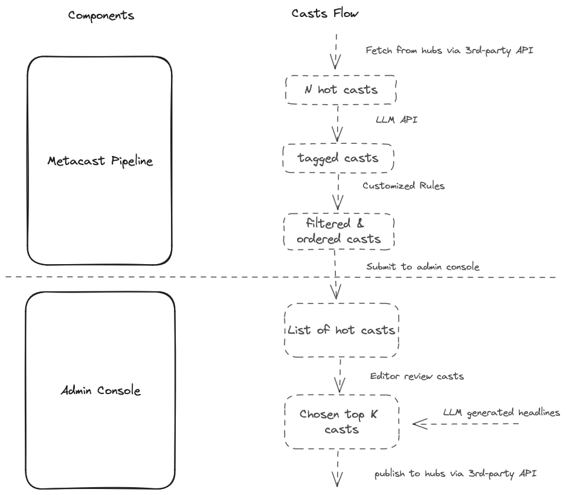

## Web admin console for MetaCast 

This is the admin console part of MetaCast system, a tool for curating and publish casts in [/metacast](https://warpcast.com/~/channel/metacast) channel on Farcaster.

## Architecture
The whole system is composed of two parts: 
* The [MetaCast Pipeline](https://github.com/alexchenzl/metacast-pipeline), which is a casts processing pipeline that takes casts from the Farcaster network, processes them with LLM and submits them to the admin console. 
* The [admin console](https://github.com/alexchenzl/metacast), which is a Next.js app that helps editors to manage and publish casts.

## Deployment
* For pipeline deployment, please refer to the [MetaCast Pipeline](https://github.com/alexchenzl/metacast-pipeline) repository. 

* The admin console is deployed on Vercel. Please refer to the [Deploying GitHub Projects with Vercel](https://vercel.com/docs/deployments/git/vercel-for-github) to learn how to deploy on Vercel.
  * The system uses [Vercel Postgres](https://vercel.com/docs/storage/vercel-postgres) as the storage backend. So you need to create a Vercel Postgres instance and set the environment variables even if you are debugging locally.
  * Please check if the environment variables are set correctly if you encounter some issues when deploying the app on Vercel. 
